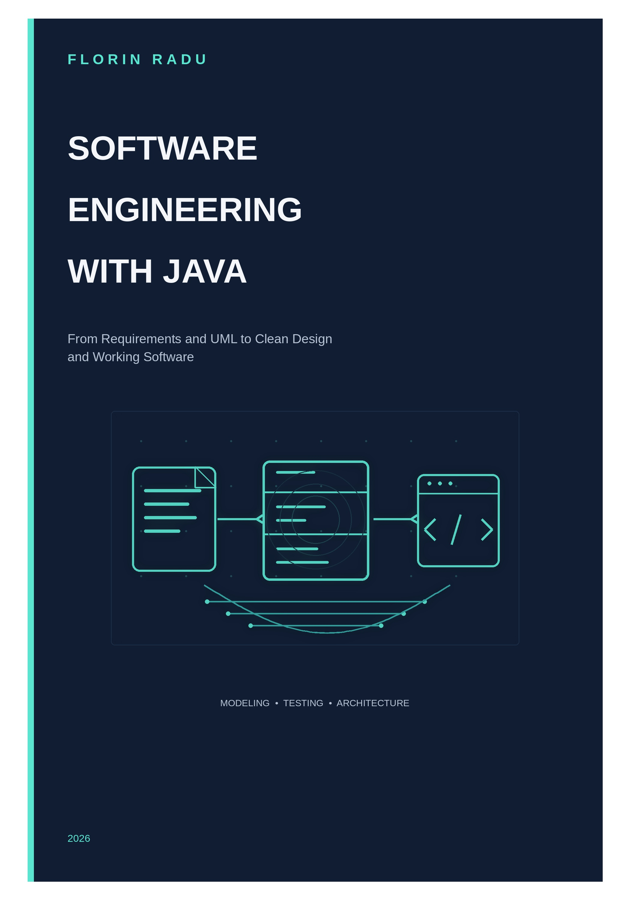

<p align="center">
  
</p>

<h1 align="center">Software Engineering with Java</h1>

<p align="center">
  <strong>From Requirements and UML to Clean Design and Working Software</strong>
</p>

<p align="center">
  Code examples and companion material for the book by <strong>Florin Radu</strong>.
</p>

> **UNDER CONSTRUCTION**
> This book and its companion repository are currently being developed. The chapter structure, examples, package names, and APIs may change until the first public release.

This repository is the companion code repository for the forthcoming book **_Software Engineering with Java: From Requirements and UML to Clean Design and Working Software_**.

The book presents software engineering as a practical path from requirements and models to maintainable Java applications. It combines software development processes, UML, object-oriented design, testing, design patterns, persistence, architecture, and a focused introduction to concurrency.

## Status

**UNDER CONSTRUCTION.** Examples are being reorganized and rewritten from teaching material into a book-oriented structure. Code that appears here before the first release should be considered provisional.

## Planned book structure

### Part I — Software Engineering Foundations
1. Introduction to Software Engineering
2. Software Development Processes
3. A Modern Software Engineering Toolchain

### Part II — From Requirements to Models
4. Requirements Engineering
5. Modeling Software with UML
6. Use Cases and Functional Modeling
7. Class Diagrams and Domain Modeling

### Part III — Implementing the Model with Java
8. Java Essentials for Software Engineers
9. Object-Oriented Programming
10. Interfaces, Abstract Classes, Enums, and Records
11. Organizing Java Software

### Part IV — Building Reliable Java Applications
12. Collections and Data Structures
13. Exceptions and Robust Software
14. Functional-Style Programming with Java Streams
15. Input/Output and Persistence

### Part V — Interaction and Software Behavior
16. Event-Driven Software and Graphical Interfaces
17. Modeling Dynamic Behavior

### Part VI — Designing Maintainable Software
18. The SOLID Principles
19. Design Patterns
20. Testing Java Software

### Part VII — Persistence, Architecture, and Concurrency
21. Relational Databases and JDBC
22. Software Architecture and Dependency Injection
23. Concurrency in Software Applications

### Part VIII — Complete Case Study
24. From Requirements to Working Software

## Planned repository layout

```text
software-engineering-with-java/
├── README.md
├── pom.xml
├── assets/
│   └── book-cover.jpg
├── chapter03-toolchain/
├── chapter06-use-cases/
├── chapter07-class-diagrams/
├── chapter09-oop/
├── chapter12-collections/
├── chapter13-exceptions/
├── chapter14-streams/
├── chapter16-gui/
├── chapter18-solid/
├── chapter19-design-patterns/
├── chapter20-testing/
├── chapter21-jdbc/
├── chapter23-concurrency/
└── case-study/
    └── persons/
```

The final repository layout may be simplified while the manuscript is being written. Examples will be kept independent where possible, while the `case-study` directory will contain the evolving application used throughout the book.

## Requirements

The target environment for the book is:

- **Java 25**
- **Maven 3.9+**
- A current IDE such as IntelliJ IDEA or NetBeans
- Additional dependencies only where required by individual chapters

## Companion examples

The repository will contain:

- runnable Java examples referenced by the book;
- UML-related implementation examples;
- JUnit tests;
- design-pattern and SOLID examples;
- JDBC and persistence examples;
- selected concurrency examples;
- the complete running case study.

## Running the examples

Build instructions will be added as the repository structure stabilizes. The intended baseline is Maven-based Java projects that can be opened directly in a modern IDE or built from the command line.

## Book availability

Publication links will be added here when the book becomes available.

## License


The source code in this repository is provided as companion material for the book.

The source code in this repository is licensed under the [Apache License 2.0](LICENSE).

The text, figures, and other content of the book are not covered by the source-code license.

---

<p align="center">
  <strong>Software engineering is not only about writing code.<br>
  It is about designing software that can evolve.</strong>
</p>
